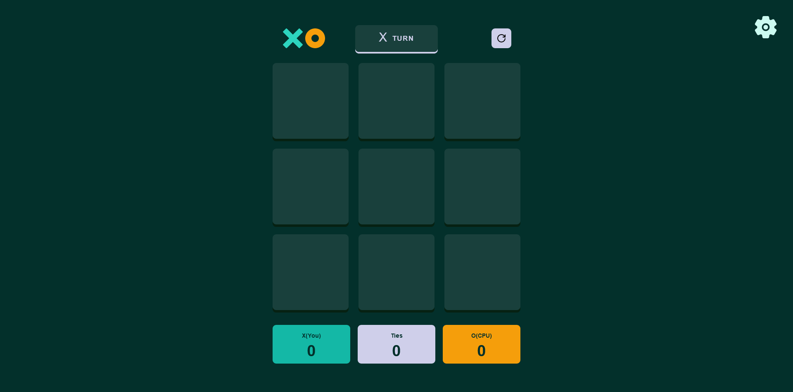
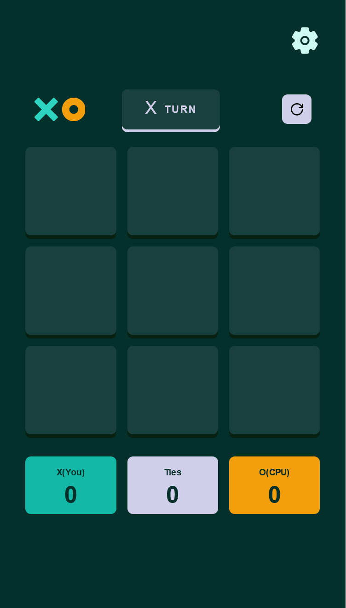
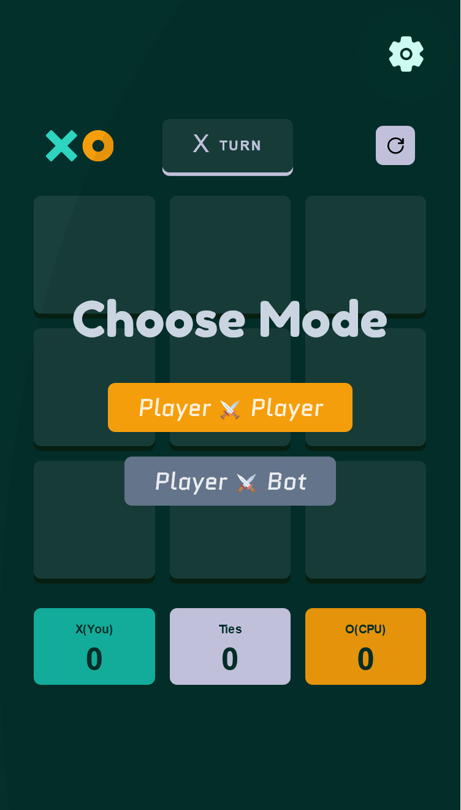
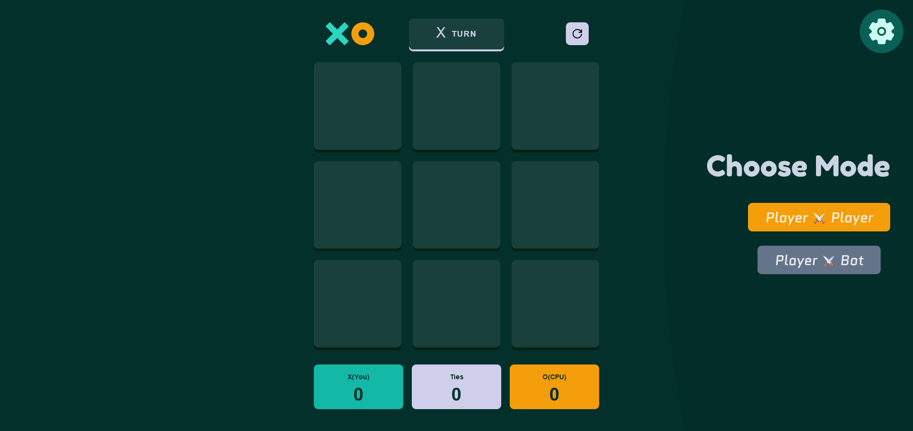
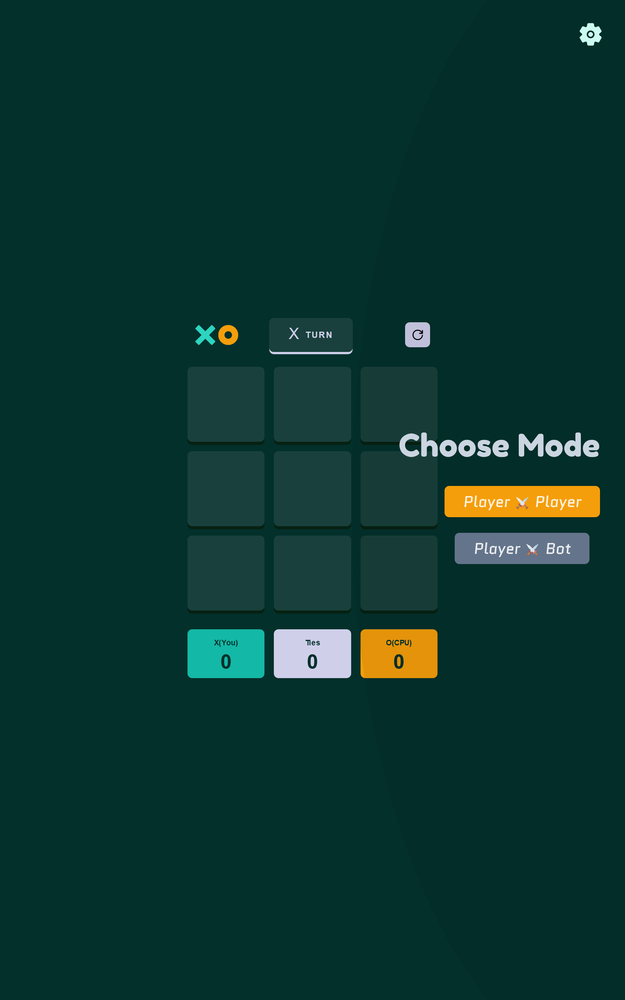
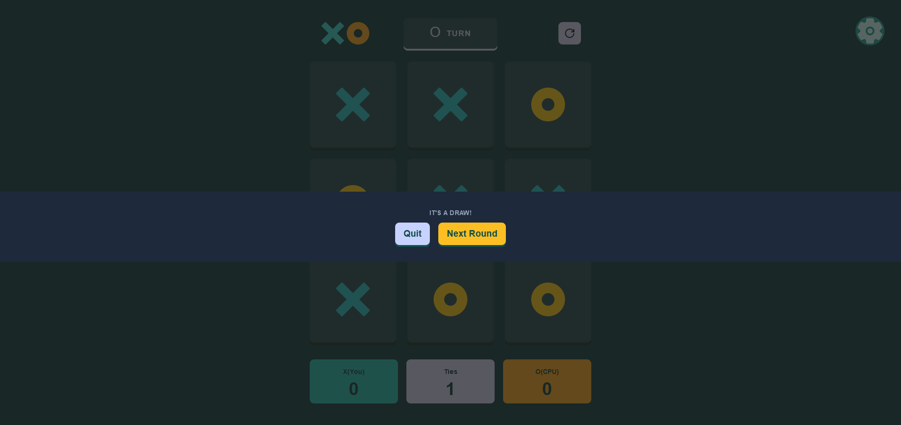

# Project - TicTacToe game

This is one of my side projects which I had built to practice my frontend skills.

## Table of contents

- [Overview](#overview)
    + [The challenge](#the-challenge)
    + [Screenshot](#screenshot)
    + [Links](#links) 
- [My process](#my-process)
    + [Build with](#built-with)
    + [What I learned](#what-i-learned)
    + [Continued development](#continued-development)
    + [Useful resources](#useful-resources) 
- [Author](#author) 
- [Acknowledgements](#acknowledgements)

## Overview

 ### The challenge

  #### Initial challenges:

   ##### Users should be able to

    - View the optimal layout for the site depending on their device's screen size

    - See hover states for all interactive elements on the page

    - Enter the input(X/O) in the main game board with just a click on the grid elements

   ##### Important game features

    - Maintaining a scoreboard for the win for X, win for O and draw between X and O.

    - Find a winner and display an appropriate modal for different game endings like the win for X, win for O or a draw with slight variations.

    ###### Instant Quit feature

     - The modal would have a feature for resetting the board and scoreboard.

    ###### Round feature in the game

     - Preserving W/L/D records for players in between rounds.

  #### Challenges faced during the new version of the game

   ##### Version - 1

    - Adjust the game mode from PvP mode to PvBot and vice versa.

    - Adding a feature of playing the game against a bot

    - Adding an AI to the bot so that it responds with an optimal move.

    - Improving the smartness of the AI so that it looks to respond with moves that result in a draw, in fewer moves, in the case where there is no chance of winning.

   ##### Version - 2

    - Improving the layout of the modal for the game mode.

    - Improving the algorithm for the bot so that it responds with the best move for that particular game position.

### Screenshot

> ##### Desktop normal view 



> ##### Mobile normal view



> ##### Mobile feature overlay



> ##### Desktop feature overlay



> ##### Medium screen feature overlay



> ##### Draw



> ##### X won!


> ##### O won!


### Links

 - Live Site URL: [Visit the site now](https://tic-tac-toe-vite.vercel.app)

## My process

### Built with

 - Semantic HTML5 markup
 - [Tailwind CSS][Tailwind site]
 - [Vite][ Vite site]
 - [React][React beta docs] - JS library
 - [TypeScript][Typescript docs]


### What I learned

 - I learned various typescript usages with react.
 
 - Improved my knowledge about different react hooks such as use-state and use-effect.

 - Improved my understanding of state and props in react.

 - Learned about minimax algorithm and alpha-beta pruning.

 - Learned about react portals and how they work.


### Code snippet which I am proud of 

```js
function minimax(
  arr: string[],
  depth: number,
  isMax: boolean,
  alpha: number,
  beta: number
) {
  //If X wins
  if (evaluateBoard(arr, true) === 10) {
    return 10 - depth;
  }
  //If Y wins
  if (evaluateBoard(arr, false) === -10) {
    return -10 + depth;
  }
  //If it is a draw
  if (isBoardFull(arr)) {
    return 0;
  }
  let best: number;
  if (isMax) {
    best = min;
    for (let i = 0; i < arr.length; i++) {
      if (arr[i] === " ") {
        arr[i] = Human;
        let val = minimax(arr, depth + 1, !isMax, alpha, beta);
        arr[i] = " ";
        //alpha beta pruning
        best = Math.max(best, val);
        alpha = Math.max(best, alpha);
        if (beta <= alpha) {
          break;
        }
      }
    }
  } else {
    best = max;
    for (let i = 0; i < arr.length; i++) {
      if (arr[i] === " ") {
        arr[i] = AI;
        let val = minimax(arr, depth + 1, !isMax, alpha, beta);
        arr[i] = " ";
        //alpha beta pruning
        best = Math.min(best, val);
        beta = Math.min(best, beta);
        if (beta <= alpha) {
          break;
        }
      }
    }
  }
  return best;
}
```

### Continued Development

 - I liked how easy it became to make my app responsive, using **Tailwind CSS** and would like to improve the way I use it.

 - Reduce my development time on styling and focus more on the logic part of the application.

 - I would like to use different testing libraries such as **Jest** or **react testing library** in my future projects as I struggled with manually testing my app.


### Useful resources

 - [React documentation for createPortal][React docs portals section]

 - [Passing props to a component][React docs props section]

 - [Tailwind documentation][Tailwind site]

 - [React with typescript cheatsheet][Typescript react cheatsheet blog]

 - [Dialog element in HTML5][Dialog element docs]


## Author

 - My GitHub profile- [Hritick Bhushan][GithubProfile]

## Acknowledgments

 - Thanks to Utsav Barnwal for suggesting improvements on the test version of this app which I had built before. 

<!-- Link extractions:  -->
[GithubProfile]: https://github.com/hrk-berserker27
[Dialog element docs]: https://developer.mozilla.org/en-US/docs/Web/HTML/Element/dialog
[Typescript react cheatsheet blog]: https://blog.bitsrc.io/react-with-typescript-cheatsheet-9dd891dc5bfe
[Tailwind site]: https://tailwindcss.com
[React docs props section]: https://beta.reactjs.org/learn/passing-props-to-a-component
[React docs portals section]: https://beta.reactjs.org/reference/react-dom/createPortal
[Vite site]: https://vitejs.dev
[React beta docs]: https://beta.reactjs.org/
[Typescript docs]: https://typescriptlang.org
